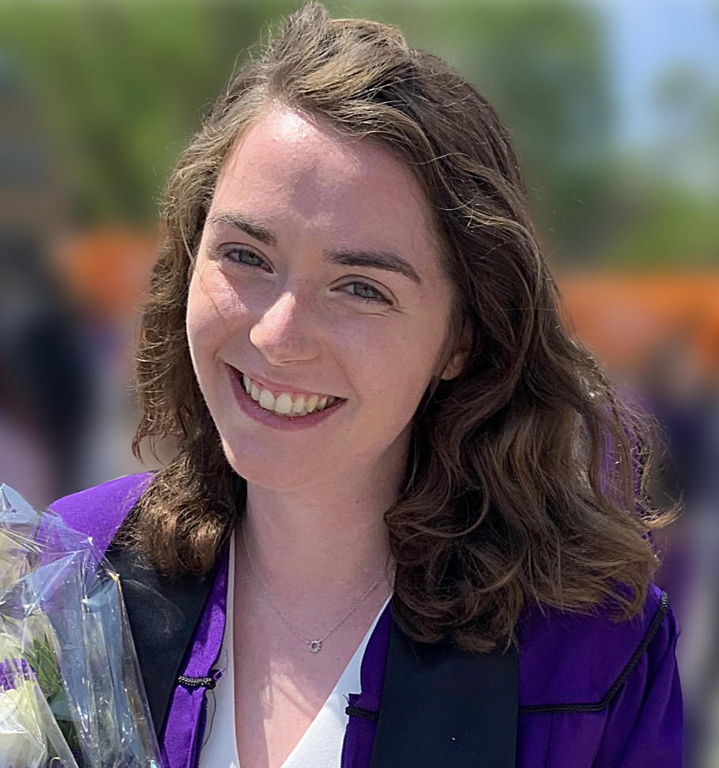

# Meet the MSE Outreach Team

**MSE Outreach** is a volunteer organization founded by graduate students at the **University of Michigan**. Our mission is to inspire K-12 and undergraduate students by sharing the wonders of **Materials Science and Engineering** through hands-on demonstrations, workshops, and community events.

We aim to ignite curiosity and show that science is both exciting and impactful.

---

  
  <strong>Zoe Meyer</strong> 
  President 
  PhD Pre-Candidate, Materials Science & Engineering 
  B.S. Mechanical Engineering, UT Austin 
  Biomaterials & polymer coatings 
  Favorite Demo: Iodine Clock, Marshmallow Towers 
  Favorite Property: Glass transition temperature

  
  <strong>Yvonne Amaria</strong> 
  Vice President 
  PhD Student, Materials Science and Engineering 
  B.Sc. CS & Math, Huston Tillotson University 
  Design of New Materials 
  Favorite Demo: Electroplating 
  Favorite Property: Yield Strength

  
  <strong>Alexis Luglio</strong> 
  Member – Demo Planning 
  PhD Candidate, Materials Science & Engineering 
  B.S. Chemistry, The College of New Jersey 
  Batteries 
  Favorite Demo: Battery or solar cell 
  Favorite Property: Electronic and ionic conduction

  
  <strong>Kayla Huang</strong> 
  Member – Demo Planning, Website 
  PhD Pre-Candidate, Materials Science & Engineering 
  B.S. MSE, University of Illinios Urbana-Champaign 
  Predictive synthesis, solid-state synthesis 
  Favorite Demo: Ice cream in a bag 
  Favorite Property: Thermal conductivity

  
  <strong>Jason Landini</strong> 
  Member – Website 
  PhD Pre-Candidate, MSE 
  M.S. & B.S. MSE, University of Michigan 
  Solidification Modeling 
  Favorite Demo: Rock Candy / Crystal Growth 
  Favorite Property: Partition Coefficient

  
  <strong>Caroline Harms</strong> 
  Member – Demo Planning 
  PhD Pre-Candidate, MSE 
  B.S. MSE, Northwestern University 
  Bioinspired polymer coatings 
  Favorite Demo: Nylon rope trick 
  Favorite Property: Wettability

  
  <strong>Maalini Krishna</strong> 
  Member – Demo Planning 
  PhD Pre-Candidate, MSE 
  B.S. Applied & Engineering Physics, Cornell University 
  2D materials, electron microscopy 
  Favorite Demo: Chocolate tempering 
  Favorite Property: Electrical conductivity

  
  <strong>Lakshman Vijay</strong> 
  Member – Demo Planning, Events 
  Master's, MSE 
  B.Tech Mechanical Engineering, VIT 
  Soft/functional materials, drug delivery 
  Favorite Demo: Rocket Candy 
  Favorite Property: Specific strength

  
  <strong>Nicholas David</strong> 
  Member - website 
  PhD Candidate, Materials Science & Engineering 
  B.S. Materials Science & Engineering, Carnegie Mellon University 
  Predictive synthesis, thermodynamics, & materials informatics 
  Favorite Demo: Thermite 
  Favorite Property: Superconductivity

---

Want to get involved or learn more about our outreach? Reach out to any of our members or email us at **mse-outreach@umich.edu**!
