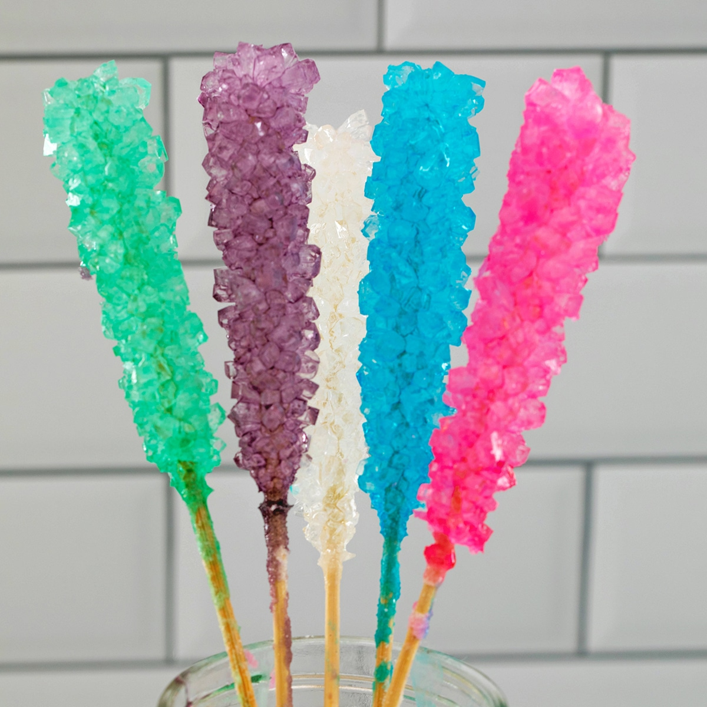

# Rock Candy: Grow Sweet Crystals

Turn ordinary sugar and water into dazzling crystal formations—Rock Candy is a sweet example of supersaturation and nucleation in action!

<figure markdown="span">
  { width="500", loading=lazy }
</figure>

---

## What You’ll Learn
- How **supersaturated solutions** form  
- Why crystals nucleate on rough surfaces  
- The impact of **temperature** and **concentration** on crystal growth  
- Patience and design in materials engineering  

---

## Supplies Checklist
- **Granulated sugar** (white or colored)  
- **Water**  
- **Glass jar** or clear cup (12–16 oz mason jar ideal)  
- **Wooden skewer** or string  
- **Clothespin** or tape (to hold skewer)  
- **Saucepan**  
- **Plate** (to coat skewer)  
- Optional: **Food coloring**, **flavor extract**  

<figure markdown="span">
  { width="500", loading=lazy }
  <figcaption>Everything you need for rock candy—simple, safe, and sweet.</figcaption>
</figure>

???+ question  
    Why does coating your skewer in sugar help crystals grow faster?

---

## The Science: Supersaturation & Nucleation

A **supersaturated solution** holds more dissolved solute than it would at room temperature:

1. **Heat** water → solubility ↑ → dissolve extra sugar  
2. **Cool** solution slowly → becomes unstable → sugar exits solution as crystals  

Crystals form on **nucleation sites**—the rough sugar on your skewer is perfect for this!

---

## Step-by-Step Crystal Craft

### 1. Prepare & Coat Skewer  
- Dip skewer in **water**, then roll in **dry sugar** → let dry 10 min.  

<figure markdown="span">
  { width="500", loading=lazy }
  <figcaption>Sugar crystals pre-seed your skewer for growth.</figcaption>
</figure>

### 2. Dissolve the Sugar  
- Boil **1 cup** water in saucepan.  
- Add **3 cups** sugar, one cup at a time, stirring until clear.  
- (Optional) Stir in **food coloring** or **vanilla extract**.

<figure markdown="span">
  { width="500", loading=lazy }
  <figcaption>Stirring sugar into boiling water until fully dissolved.</figcaption>
</figure>

### 3. Cool & Set Up Jar  
- Remove from heat, cool **20 min** to room temperature.  
- Warm your jar with hot tap water → pour in cooled solution.  
- Suspend skewer 1″ from the bottom, secure with clothespin.

<figure markdown="span">
  { width="500", loading=lazy }
  <figcaption>Skewer held in place for crystal growth.</figcaption>
</figure>

### 4. Grow Your Crystals  
- Cover jar loosely (plastic wrap or towel).  
- **Wait 5–7 days**, checking daily for formation.  
- If no crystals after 24 h → reheat solution, add extra sugar, reset.

<figure markdown="span">
  { width="500", loading=lazy }
  <figcaption>Rock candy developing over several days.</figcaption>
</figure>

???+ question  
    How does the cooling rate affect crystal size and clarity?

---

## Variations & Design Challenges

- **Color & flavor**: Try different extracts or layered colors.  
- **Crystal size**: Use slower cooling (ice bath vs. room temperature).  
- **Nucleation patterns**: Twist pipe cleaners or use textured string.

<figure markdown="span">
  { width="500", loading=lazy }
  <figcaption>Layered red and blue rock candy—experiment with patterns!</figcaption>
</figure>

???+ challenge  
    Design a gradient rock candy: firmer crystals at the bottom, finer at the top. How would you adjust concentration or temperature?

---

## Real-World Connections

- **Pharmaceuticals**: Controlled crystallization of drugs for purity and dosage.  
- **Materials Engineering**: Crystal growth in semiconductors and photonics.  

<figure markdown="span">
  { width="500", loading=lazy }
  <figcaption>Engineered crystals in microchips require precise growth control.</figcaption>
</figure>

---

## Summary

- You created a **supersaturated solution** and grew sugar crystals.  
- You learned about **nucleation**, **growth rates**, and **design parameters**.  
- You practiced **engineering thinking**—iterating to get the perfect candy!

Head back to the [Outreach Homepage](../index.md) for more sweet demos!  
