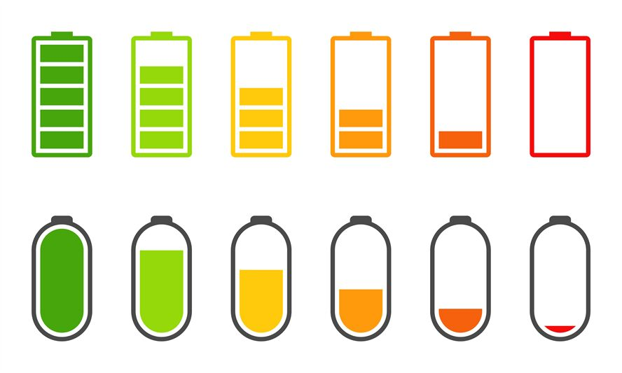
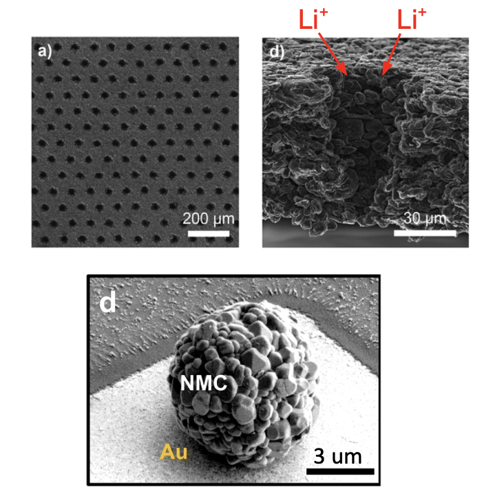

# Battery Lab: Light It Up!

<figure markdown="span">
  
   *silly little battery cartoon.*
</figure>

Welcome to the **Battery Lab**, where you become an electrical engineer and materials scientist in one! In this hands-on demo, you'll use simple materials to build your own working battery — and understand the science behind every spark.

---

## What You'll Learn
- How batteries store and deliver energy
- The role of materials in electrochemistry
- How to measure and amplify voltage
- How real MSE researchers at UM are improving battery tech

---

## Supplies Checklist
- Flexible **ice cube tray**
- **Salt** (KCl or NaCl)
- **Water**
- **Copper wire** (cathode)
- **Aluminum wire** (anode)
- **Multimeter** + **alligator clips**
- **Beaker** or mixing cup
- Optional: **LED**

<figure markdown="span">
  { width="500", loading=lazy }
  <figcaption>Your materials: common, cheap, and ready to shine.</figcaption>
</figure>

???+ question  
    Why are we using copper and aluminum wires? What might they contribute to our battery?

---

## ⚡ What is a Battery?

A battery converts **chemical energy** into **electrical energy** through a redox reaction:

- **Oxidation**: At the anode, metal atoms lose electrons  
- **Reduction**: At the cathode, metal ions gain electrons  

<figure markdown="span">
  { width="500", loading=lazy }
  <figcaption>Electrons flow from aluminum (anode) to copper (cathode) through the wire.</figcaption>
</figure>

We use an **electrolyte** (salt water) to let ions move between electrodes and keep the charge balanced.

???+ question  
    What would happen if we didn’t include the electrolyte?

---

## Step-by-Step Assembly

### Step 1: Mix the Electrolyte
- Stir **5 g of salt** into **60 g of water**  
- Use warm water for faster dissolving

### Step 2: Fill and Insert Electrodes
- Fill one well of the ice cube tray with solution  
- Insert **Al wire (–)** and **Cu wire (+)**, not touching each other  

<figure markdown="span">
  { width="500", loading=lazy }
  <figcaption>A single-cell saltwater battery setup.</figcaption>
</figure>

### Step 3: Measure Voltage
- Connect the multimeter using clips  
- Select **DC Voltage (VDC)**  
- Record your result (~0.8 V is typical!)  

<figure markdown="span">
  { width="500", loading=lazy }
  <figcaption>Voltage measurement with aluminum and copper.</figcaption>
</figure>

???+ question  
    What happens if you swap the multimeter leads?

---

## Switch It Up

### Try different cathodes:
- **Graphite** (from pencils)  
- **Steel wire**  
- **Brass sheets**  

<figure markdown="span">
  { width="500", loading=lazy }
  <figcaption>Explore how materials affect battery performance.</figcaption>
</figure>

### Build a Multi-Cell Battery
- Use 3 + tray wells with electrodes  
- Connect them **in series**: Al→Cu, Al→Cu…  

<figure markdown="span">
  { width="500", loading=lazy }
  <figcaption>Series connection boosts voltage. Each cell adds ~0.8 V.</figcaption>
</figure>

???+ question  
    If 1 cell = 0.8 V, how many cells to power a red LED (2.0 V)? A blue LED (3.2 V)?

---

## 💡 Let’s Light It Up

Try powering:  
- **Red LED** (~2 V)  
- **Green or blue LED** (~3 V)  
- Maybe even a **motor** if you’re ambitious!  

<figure markdown="span">
  { width="500", loading=lazy }
  <figcaption>Did your battery light an LED?</figcaption>
</figure>

???+ challenge  
    Try powering a small DC motor. Can you design a battery strong enough?

---

## Science Behind It

### Half Reactions:
- **Anode:** Al → Al³⁺ + 3 e⁻  
- **Cathode:** Cu²⁺ + 2 e⁻ → Cu  

<figure markdown="span">
  { width="500", loading=lazy }
  <figcaption>The farther apart two metals are on this chart, the higher the voltage.</figcaption>
</figure>

---

## MSE Research at UM

<figure markdown="span">
  { width="500", loading=lazy }
  <figcaption>UM MSE researchers engineer faster-charging batteries using lasers!</figcaption>
</figure>

### Real Topics UM Students Explore:
- Fast-charging battery electrodes (Dasgupta Group)  
- Single-particle battery analysis (Li Group)  
- Safer, more sustainable materials  

---

## Become an MSE Engineer

<figure markdown="span">
  { width="500", loading=lazy }
  <figcaption>Students testing their hand-built batteries in action.</figcaption>
</figure>

### Design Challenge:
Can you power a motor requiring **~4–6 V at 60 mA**?

**Try:**
- Larger electrodes (more surface area = more current)  
- More cells in series  
- Better conductive materials  

???+ reflection  
    What factors limited your battery performance? How might a real engineer overcome those limits?

---

## Summary

You built a real battery.  
You experimented like a scientist.  
You designed like an engineer.

What will you power next?

_For more MSE demos, head back to the [Outreach Homepage](../index.md)._
