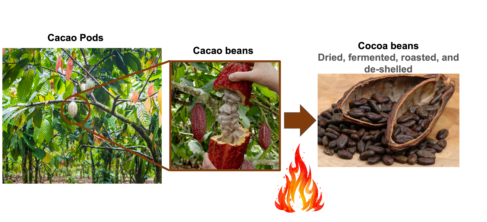
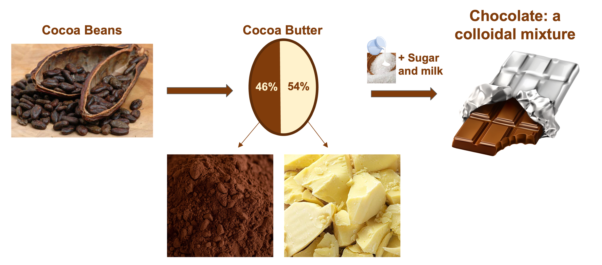
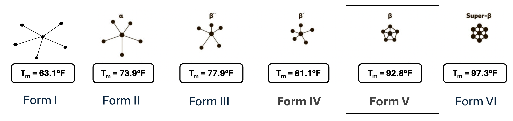
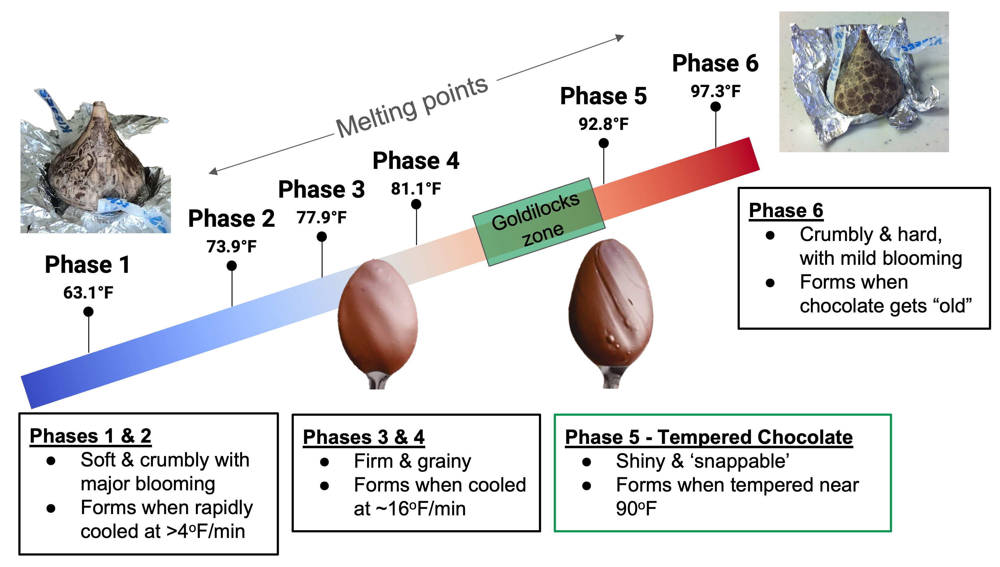
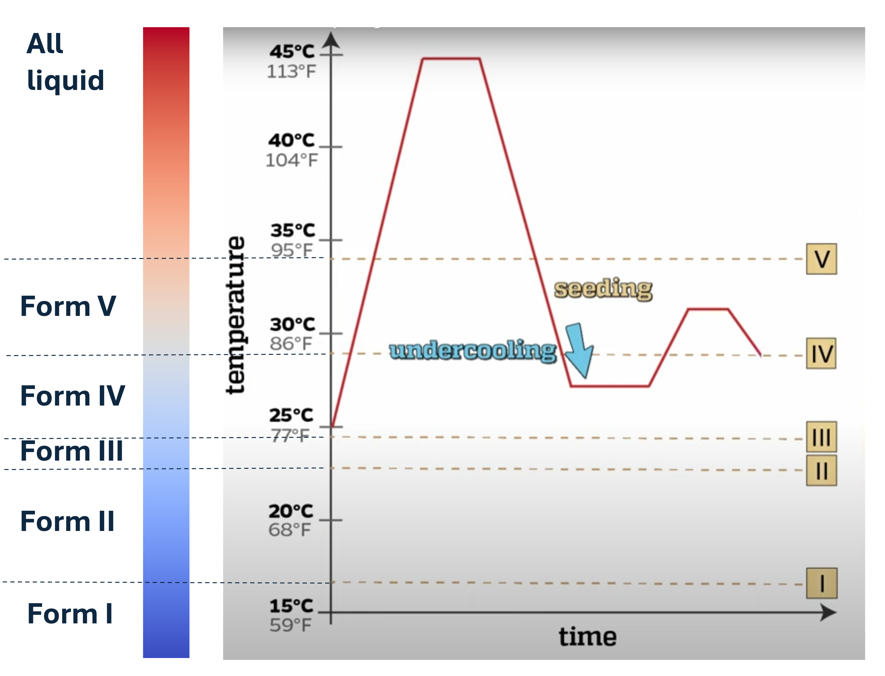
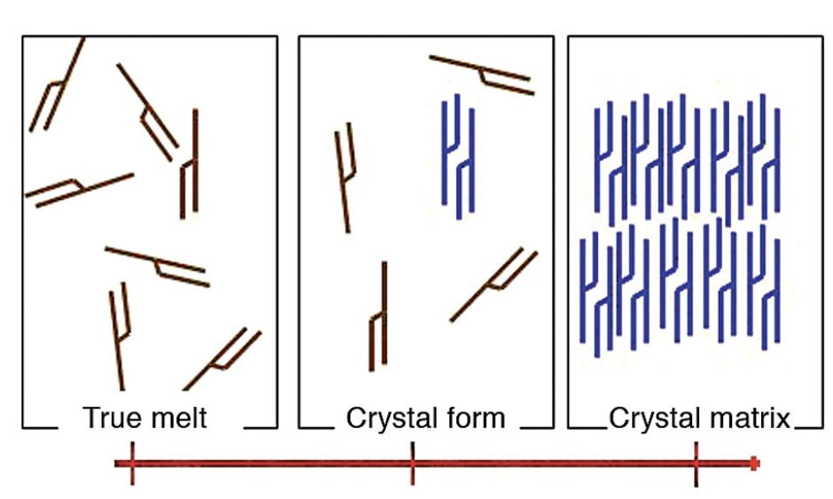

## Overview

In this demo, students will learn about the process of tempering chocolate that chocolatiers use around the world to make our favorite delicious treats.

## Supplies
- Phase V chocolate pieces
- Candy molds
- Food thermometer
- Rubber spatula
- Hot plate
- Large food safe Pyrex beaker
- Small food safe Pyrex beaker
- Silicone trivet
- Cooking mitts

## Chocolate origins

Chocolate originates from the Theobroma Cacao or Cocoa tree and only grows in a limited geographical zone -- about 20 degrees not the north and south of the Equator. More than 70% of the world's cacao crop is grown in Africa, with Ivory Coast and Ghana producing approximately 58% of global production. These plants grow cacao pods which hold the beloved cacao bean which are dried, fermented, roasted, and shelled, turning them in cocoa beans.

To turn cocoa into chocolate, the cocoa beans are crushed up, separating the 'nibs', or meat of the bean, from the shell. These nibs are mixed with cocoa butter to form a colloidal mixture -- a heterogeneous mixture of two substances where one substance is suspended in the other. To this we add sugar and milk to give chocolate the taste we know and love.

<figure markdown="span">
  { width="500", loading=lazy}
    <figcaption>Turning cacao to cocoa.</figcaption>
</figure>

<figure markdown="span">
  { width="500", loading=lazy}
  <figcaption>Chocolate as a colloidal mixture of cocoa and cocoa butter.</figcaption>
</figure>

## Chocolate structure

One type of chocolate (e.g., milk chocolate) can exist in different forms despite having the same composition. These forms have different structures which we call *polymorphs*. The cocoa butter, which gives the chocolate its structure, contains triglycerides a type of fat that changes structure at different temperatures. Different triglyceride structures can lead to different properties such as strength, taste, and appearance. In turn, this changes the overall properties of our chocolate.

???+ question

    What other materials have polymorphs? Hint: Think about pencil tips and wedding rings.

<figure markdown="span">
  { width="500", loading=lazy}
  <figcaption>Triglyceride structures in chocolate.</figcaption>
</figure>

<figure markdown="span">
  { width="500", loading=lazy}
  <figcaption>The phases of chocolate and their properties.</figcaption>
</figure>

## Heat treatment
To form the desired phase (i.e., phase V) of chocolate, we need to perform a series of heating steps to ensure crystallization. First we melt the chocolate heating it to 113 F. Then we lower the temperature of liquid such that the liquid is below its freezing point with becoming a solid, the definition of *undercooling*. During this process, 'seed' crystals of phase V chocolate will form within the liquid melt encouraging the surrounding chocolate to crystallize into phase V as well. During this step, the chocolate is scraped and folded to promote mixing. Finally, the chocolate is gently re-heated to remove any phase IV chocolate that has formed. This re-heating and cooling procedure can be repeated to obtain a more homogenous phase V chocolate product.

<figure markdown="span">
  { width="500", loading=lazy}
  <figcaption>A diagram of the heat treatment steps to form phase V chocolate.</figcaption>
</figure>

## Experimental procedure
???+ warning
    Safety First! The hot plates and double boiler are too hot to touch with bare hands. Use oven mitts to handle the heated materials. Wear nitrile gloves for sanitation and safety glasses, because you never know when accidents can happen in the lab! Remember, a hot beaker looks the same as a cold beaker.

1.  Place the small pyrex cup inside the larger cup, fill the water line in the outer cup as high as possible without spillage into the smaller cup. Place thermometer in the water to monitor the temperature
2.  Heat the filled double-boiler assembly on hot plate until the water temperature reaches 113-118 deg F (45-48 C). Keep track of the temperature - don’t let it get too hot!
3. Fill the small beaker ~ 1/3 full with chocolate pieces to be melted - make sure that they do not go above the water line in the large beaker. Set aside some chocolate pieces for future steps! 
4.  Now, put the thermometer into the chocolate - we want to keep track of the chocolate temperature. 
As the chocolate melts, try to keep the chocolate temperature between 113 F and 118 F while stirring. Raise or lower the hot plate temperature as necessary
5.  When the chocolate is uniformly melted, pour the chocolate melt directly into the molds (Make sure you’re wearing your oven mitts!!). This chocolate will cool quickly and solidify in the mold directly from the liquid phase. Keep track of which side you poured this chocolate into (use a sticky note, etc)

    ???+ question
        What phase of chocolate will these pieces form when they solidify? 

6.  Now, add more chocolate pieces to the double boiler and stir constantly. Once uniformly liquid again, begin adding the chocolate pieces set aside previously and stirring rigorously. You can stir with the thermometer or spatula! 
    
    ???+ question
        What happens to the temperature of the chocolate melt as more chocolate pieces melt into it? Does it increase or decrease, and why? (Hint: does melting absorb or release heat?)

7.  Move the beaker with the chocolate from the double-boiler to the trivet, and continue to add chocolate/stir. As you add more chocolate pieces (make sure you’re mixing!!), allow the chocolate temperature to cool to between 80 F and 82 F (27-28C). Hold the mixture in this temperature range very carefully for 5 minutes. If you need to lower the temperature more, add more chocolate pieces, and increase the temperature by placing the beaker back in the double boiler.

    ???+ question
        Why are we adding some solid chocolate pieces, and why is this important for making phase V chocolate? What’s happening in the chocolate melt when we hold the temperature at that range? Hint: use this image to guide your thinking:
    <figure markdown="span">
      { width="500", loading=lazy}
    </figure>

8.  After 5 minutes, heat the chocolate again ever-so-slightly to 84-86 F (29-30 C). DO NOT let it go above 90 F.

    ???+ question
        Why are we heating the melt again? How does this affect the resulting chocolate?

9.  Hold the melt at this higher temperature for 2-3 minutes, and then pour the chocolate mixture into the mold.

    ???+ question
        Which phase of chocolate should these pieces be in when they solidify? What do you notice about the chocolate you poured before, and the chocolate you poured now?

## Conclusion

Congratulations! Now you're a chocolatier!