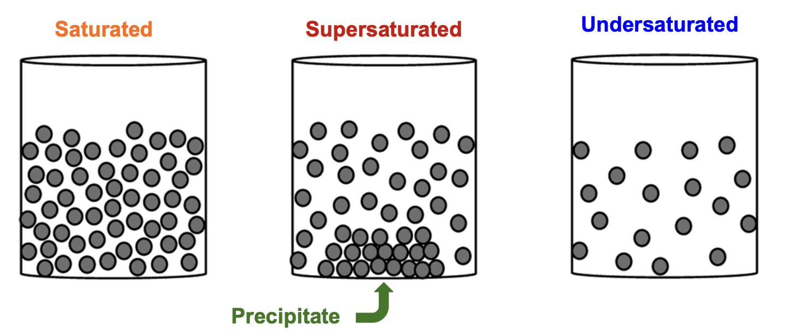
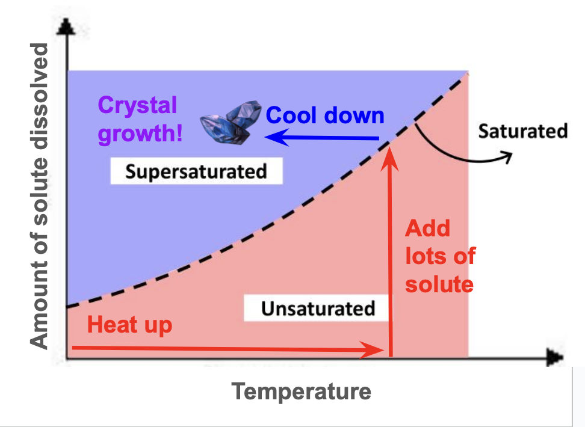
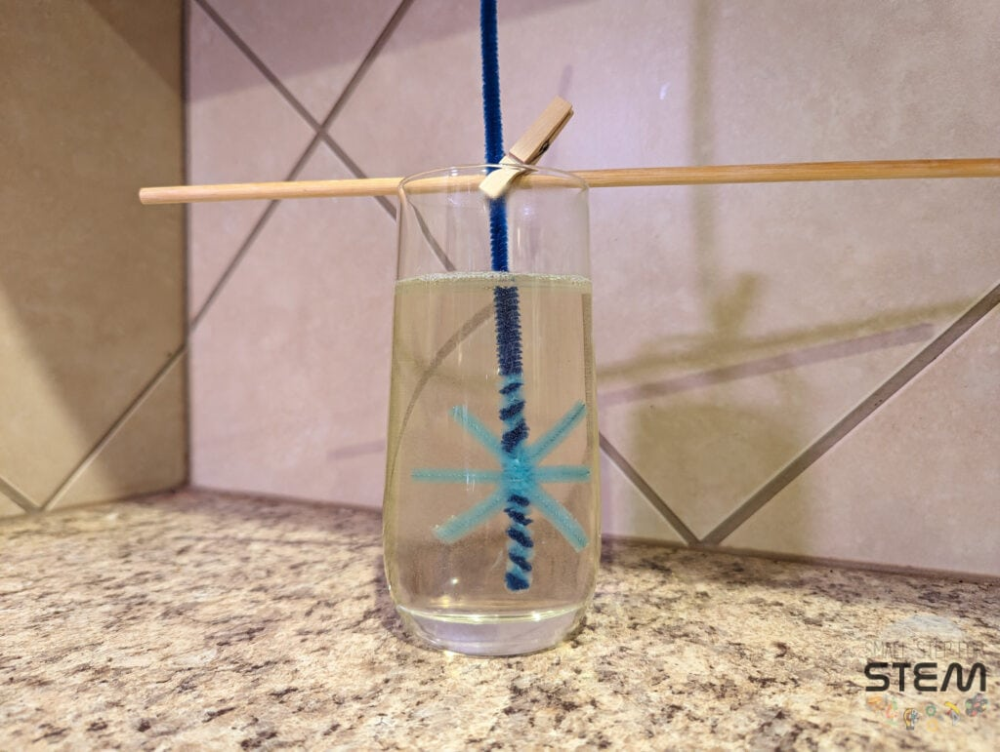
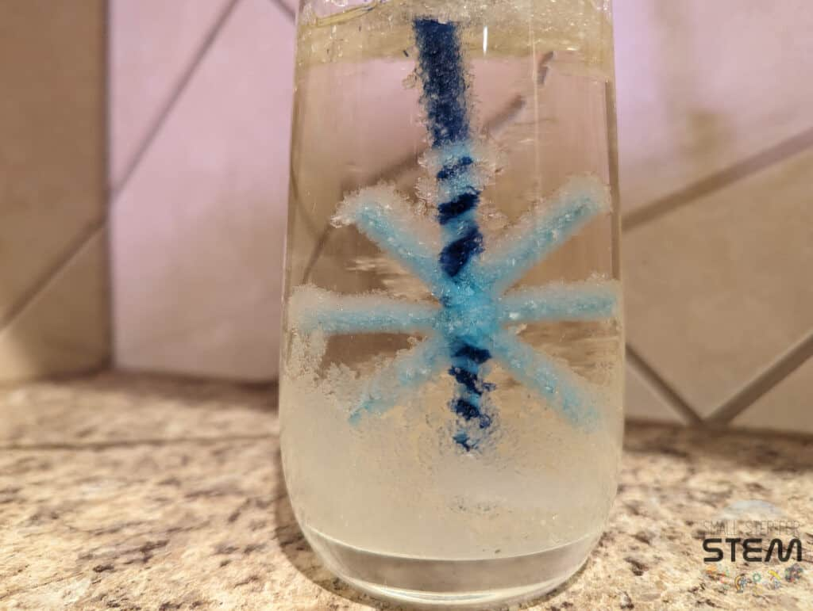
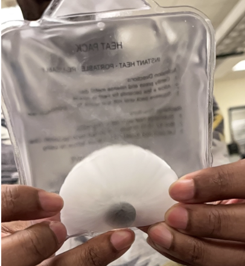
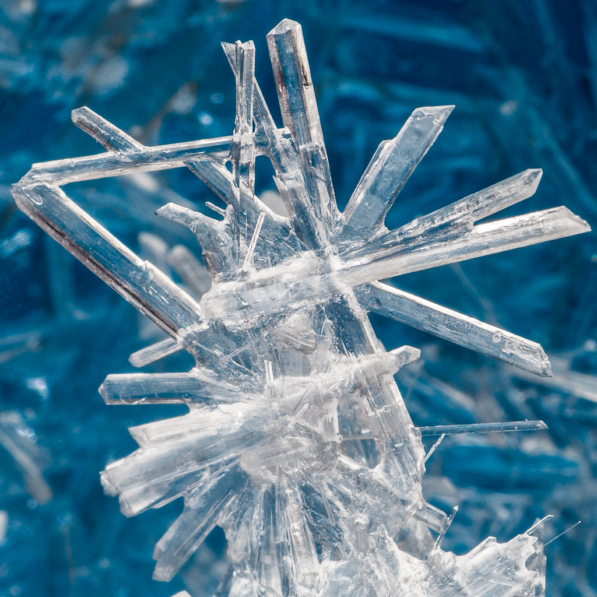
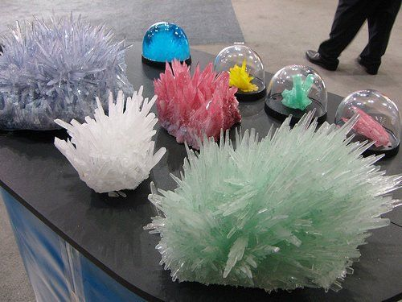

# Crystal Growth: From Supersaturated to Sparkling

In this demo, you’ll learn why crystals form, how to grow your own in fun shapes, and why crystallization matters in materials science and engineering.

---

## What You’ll Learn
- The difference between **saturated**, **unsaturated**, and **supersaturated** solutions  
- How **temperature** affects solubility and drives crystal growth  
- Hands-on: making vibrant pipe-cleaner crystals  
- Real-world exothermic crystallization (hand warmers!)  
- How MSE researchers control crystal structure for advanced materials  

---

## Supplies Checklist
- **Magnesium sulfate** (Epsom salt) or **table sugar**  
- **Hot water** (near boiling)  
- **Beakers** or clear jars  
- **Food coloring** (optional)  
- **Pipe cleaners** (shaped into fun forms)  
- **String** or thread  
- **Sodium acetate** solution (for hand-warmer demo)  
- **Thermometer** (optional)  

<figure markdown="span">
  { width="500", loading=lazy }
  <figcaption>Unsaturated vs. saturated vs. supersaturated.</figcaption>
</figure>

???+ question  
    Why can hot water dissolve more salt than cold water?

---

## Solubility & Supersaturation

A **solubility curve** shows how much solute water can hold at different temperatures. To grow crystals:
1. Heat water and **dissolve** as much solute as possible → **supersaturated**.  
2. **Cool** slowly → excess solute comes out of solution as **crystals**.

<figure markdown="span">
  { width="500", loading=lazy }
  <figcaption>Solubility of Epsom salt vs. temperature.</figcaption>
</figure>

???+ question  
    What happens if you cool too quickly or disturb the solution?

---

## Step-by-Step Crystal Growing

### Step 1: Prepare Supersaturated Solution
- Heat **250 mL** water to ~80 °C.  
- Gradually stir in **50 g** Epsom salt until no more dissolves.

### Step 2: Color & Shape
- Add **food coloring** for vibrant crystals.  
- Twist a **pipe cleaner** into a star, heart, or geometric shape. Tie it to a string.

<figure markdown="span">
  { width="500", loading=lazy }
  <figcaption>Pipe cleaner suspended in the hot, supersaturated bath.</figcaption>
</figure>

### Step 3: Grow Crystals
- Lower the pipe cleaner into the jar; leave undisturbed.  
- Wait **1–2 hours** (or overnight) for crystals to form.

<figure markdown="span">
  (../assets/crystal_growth/crystals.png){ width="500", loading=lazy }
  <figcaption>Crystal “branches” forming on the pipe cleaner.</figcaption>
</figure>

???+ question  
    How does the shape of the pipe cleaner affect crystal growth patterns?

---

## Exothermic Crystallization: Hand Warmers

Some crystals release heat when they form (exothermic). Sodium acetate “hand warmers” use this principle:

<figure markdown="span">
  { width="500", loading=lazy }
  <figcaption>Click-to-activate sodium acetate crystallization.</figcaption>
</figure>

### Quick Demo:
1. **Supersaturated** sodium acetate solution in a pouch.  
2. **Click** metal disk → triggers rapid crystallization → **heat** released!  

???+ question  
    Why does crystallization release heat for sodium acetate but absorb heat for Epsom salt?

---

## 🔬 Microscopic vs. Macroscopic Crystals

- **Microscopic**: orderly lattice at the nanoscale  
- **Macroscopic**: visible facets and shapes

<figure markdown="span">
  { width="500", loading=lazy }
  <figcaption>Microscope image of Epsom salt crystal lattice.</figcaption>
</figure>

<figure markdown="span">
  { width="500", loading=lazy }
  <figcaption>Large, well-formed crystals after slow cooling.</figcaption>
</figure>

---

## Think & Discuss
- What factors (temperature, impurities, agitation) control crystal size and shape?  
- How do engineers use crystal growth to create semiconductors, photovoltaics, or pharmaceutical drugs?

---

## MSE Research Spotlight

At Michigan, MSE students explore:
- **Bulk crystal growth** for turbine blades (superalloys)  
- **Thin-film crystallization** in solar cells  
- **Protein crystallography** in biomaterials  

---

## Design Challenge

Can you engineer a **gradient supersaturation** to grow graded crystals (small → large)?  
- Vary cooling rate along the length of the tube  
- Record crystal size vs. position  

???+ reflection  
    How might graded crystals improve real-world device performance?

---

## Summary

- You made and observed crystals from supersaturated solutions.  
- You saw exothermic vs. endothermic crystallization.  
- You connected classroom experiments to cutting-edge MSE research.

Head back to the [Outreach Homepage](../index.md) for more demos!  
