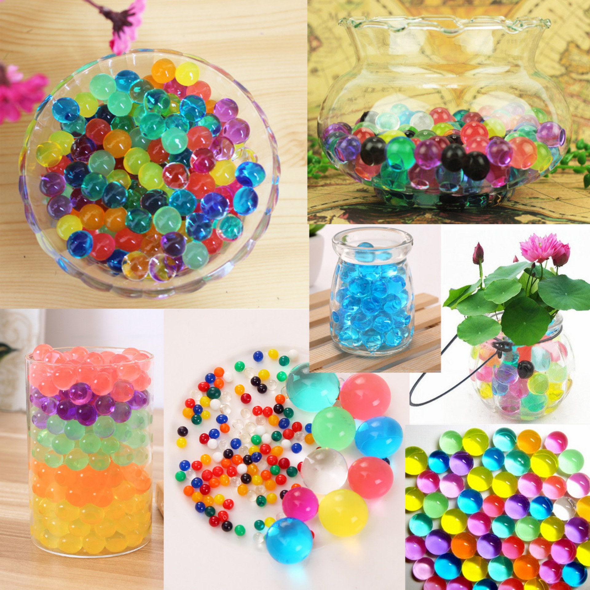
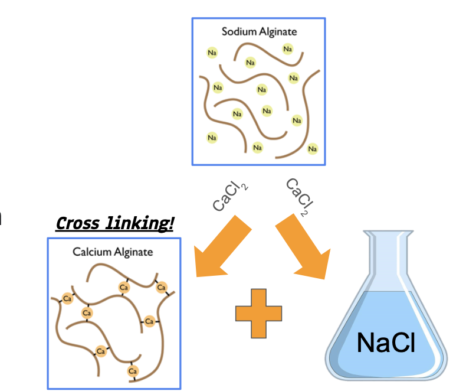
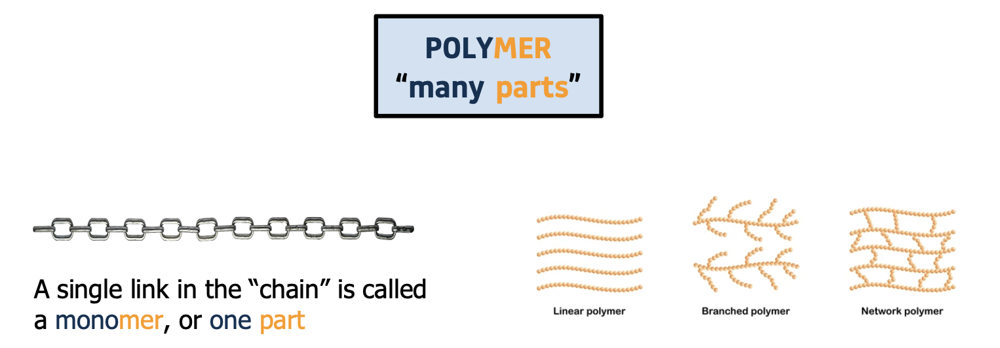
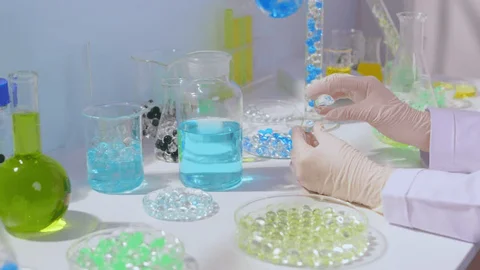
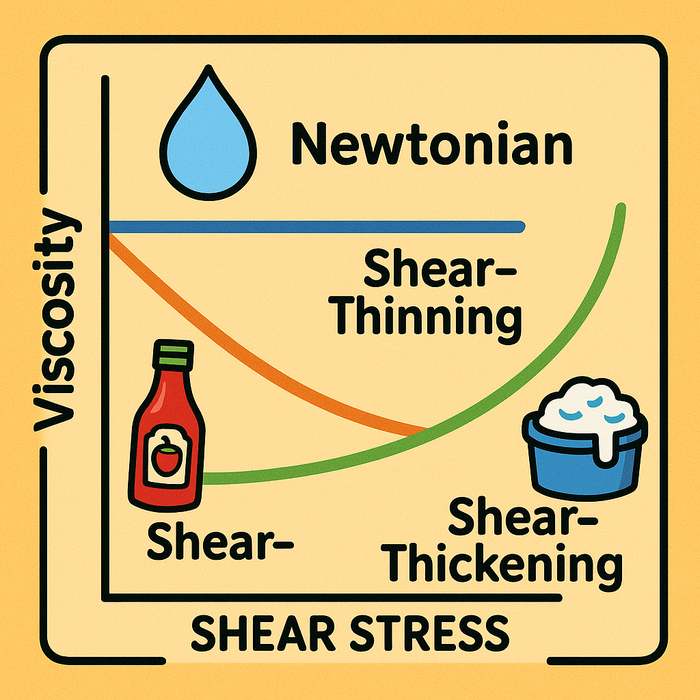
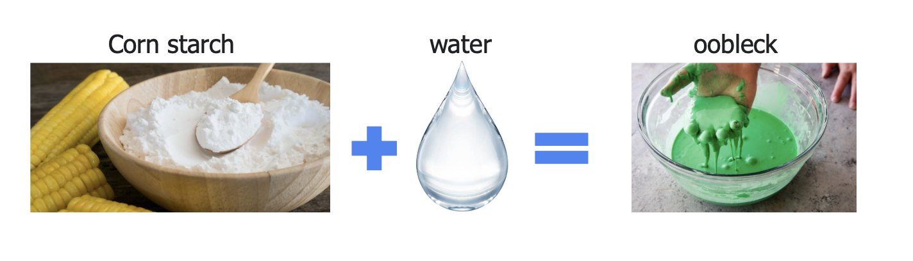
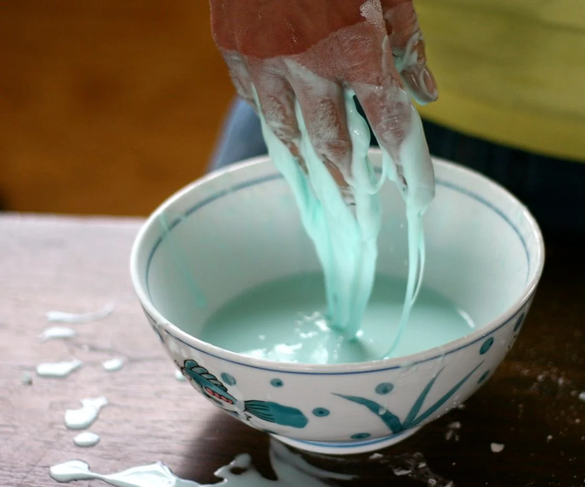
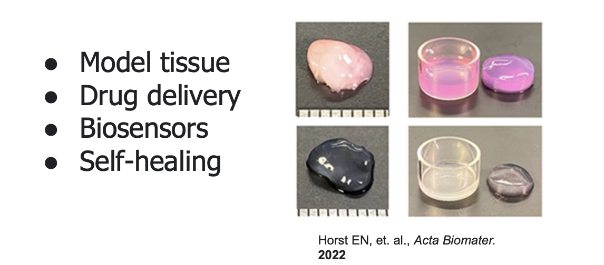

<figure markdown="span">
  
   *Hydrogel Orbeez.*
</figure>

# Polymers & Hydrogels: Stretch, Squish, and Shine!

Welcome to **Polymers & Hydrogels**, where you’ll explore materials that can behave like solids and liquids—sometimes at the same time. You’ll make water-filled hydrogels and play with oobleck to discover shear-thinning and shear-thickening behavior.

---

## What You’ll Learn
- What polymers are and how monomers link into long chains  
- How **hydrogels** form 3D networks that hold up to 99% water  
- What **viscosity** means and how it changes under stress  
- The difference between **shear-thinning** and **shear-thickening** fluids  

---

## Supplies Checklist
- **Sodium alginate** solution (colored optional)  
- **Calcium chloride** solution (crosslinker)  
- **Syringe** or dropper  
- **Beaker** or cup for CaCl₂ bath  
- **Cornstarch**  
- **Water**  
- **Bowl** or tray for oobleck  
- **Food coloring** (optional)  

<figure markdown="span">
  { width="500", loading=lazy }
  <figcaption>All set: sodium alginate (left) and calcium chloride bath (right).</figcaption>
</figure>

???+ question  
    Why does calcium chloride cause alginate chains to crosslink into a gel?

---

## What Is a Polymer?

A **polymer** is a material made of many repeating molecular “links” (monomers) bonded into long chains or networks.

<figure markdown="span">
  { width="500", loading=lazy }
  <figcaption>Monomers (one unit) link to form polymers (many units).</figcaption>
</figure>

Polymers can be **linear** or **crosslinked**. Crosslinking creates a network that can trap water—forming a **hydrogel**.

---

## Making Hydrogels

Hydrogels are 3D crosslinked polymer networks—**water gels**—that can hold up to 99% water!

### Step 1: Prepare Your Bath  
- Pour **100 mL** calcium chloride solution into a beaker.  
- Swirl gently to remove bubbles.

### Step 2: Draw Up Alginate  
- Fill a syringe or dropper with **sodium alginate solution** (colored if you like).

### Step 3: Create Hydrogel Art  
- **Inject** drops, lines, or shapes of alginate into the CaCl₂ bath.  
- Wait **30 s** for hydrogels to form.  
- Scoop out your gels and arrange them on a tray.

<figure markdown="span">
  { width="500", loading=lazy }
  <figcaption>Hydrogel beads and shapes ready for display.</figcaption>
</figure>

???+ question  
    How would increasing Ca²⁺ concentration affect gel firmness?

---

## Viscosity & Flow

**Viscosity** measures how easily a fluid flows. Water has low viscosity; honey is high viscosity.

<figure markdown="span">
  { width="500", loading=lazy }
  <figcaption>Viscosity vs. shear stress: Newtonian vs. non-Newtonian fluids.</figcaption>
</figure>

### Shear-Thinning vs. Shear-Thickening  
- **Hydrogels**: shear-**thinning** (become runnier under stress)  
- **Oobleck**: shear-**thickening** (become more solid under stress)

---

## Oobleck: Cornstarch & Water

**Oobleck** is a simple non-Newtonian fluid made from cornstarch and water.

### Make Oobleck  
- Mix **2 parts** cornstarch with **1 part** water in a bowl.  
- Stir until smooth; add water sparingly.

<figure markdown="span">
  { width="500", loading=lazy }
  <figcaption>Oobleck ready for squeezing and poking.</figcaption>
</figure>

### Test Its Behavior  
- **Press slowly**: it flows like a liquid.  
- **Punch quickly**: it behaves like a solid!

<figure markdown="span">
  { width="500", loading=lazy }
  <figcaption>Squeeze vs. strike: oobleck’s surprising response.</figcaption>
</figure>

???+ question  
    What molecular interactions cause oobleck to thicken under impact?

---

## Think & Discuss

- **Hydrogel hardness**: What changes if you add more crosslinker?  
- **Oobleck uses**: Where might we use shear-thickening fluids in real life?  
- **Polymer design**: How would you engineer a hydrogel for drug delivery or soft robotics?

---

## MSE Research Spotlight

<figure markdown="span">
  { width="500", loading=lazy }
  <figcaption>UM researchers developing amazing use cases for hydrogels.</figcaption>
</figure>

Real MSE teams at Michigan are exploring:
- **Biocompatible hydrogels** for tissue engineering  
- **Smart gels** that respond to temperature or pH  
- **Self-healing materials** that repair when damaged  

---

## Design Challenge

Can you create a **gradient hydrogel** (firmer one end, softer the other)?  
- Vary alginate or CaCl₂ concentration along a tube  
- Measure firmness with your fingers or a simple force gauge  

???+ reflection  
    What applications could benefit from a gradient hydrogel?

---

## Summary

- You learned what polymers and crosslinking are.  
- You made and tested **hydrogels** (shear-thinning) and **oobleck** (shear-thickening).  
- You connected classroom demos to **real MSE research**.

Head back to the [Outreach Homepage](../index.md) for more demos!  
