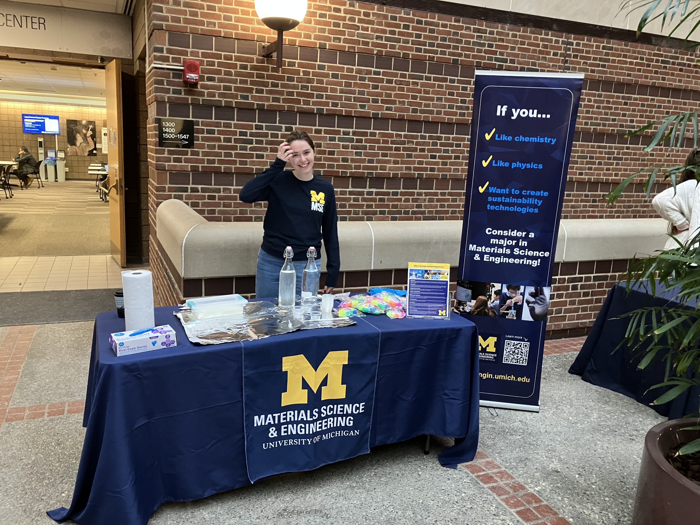
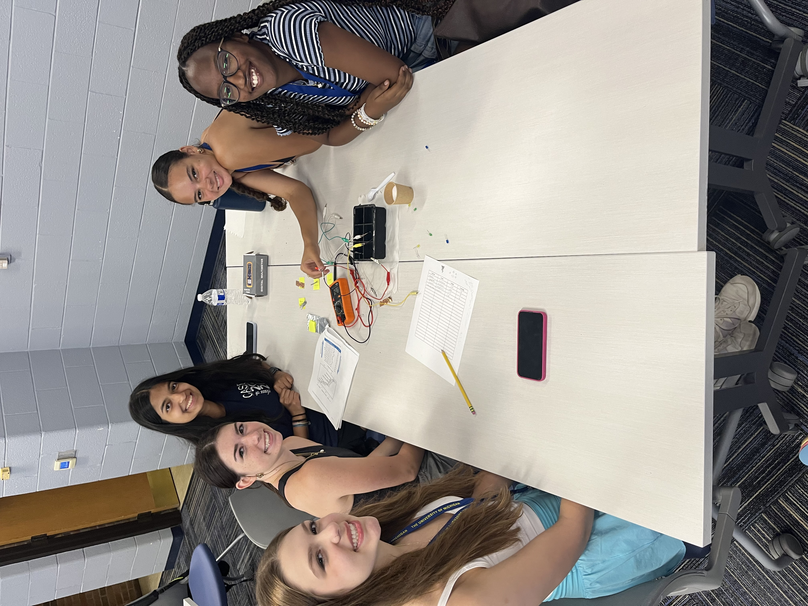
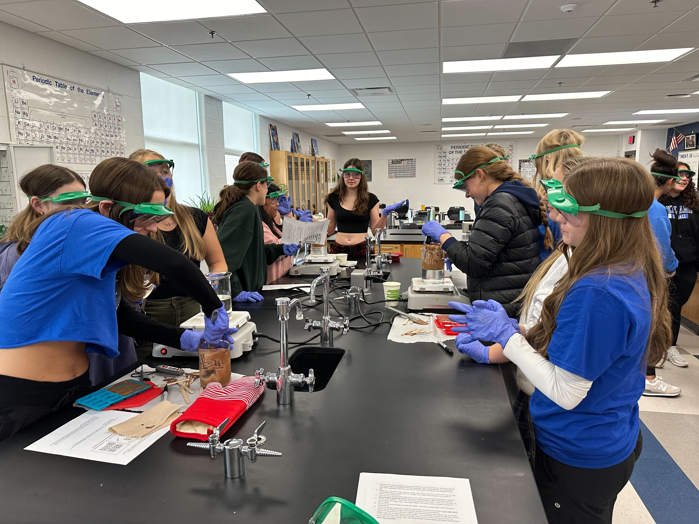
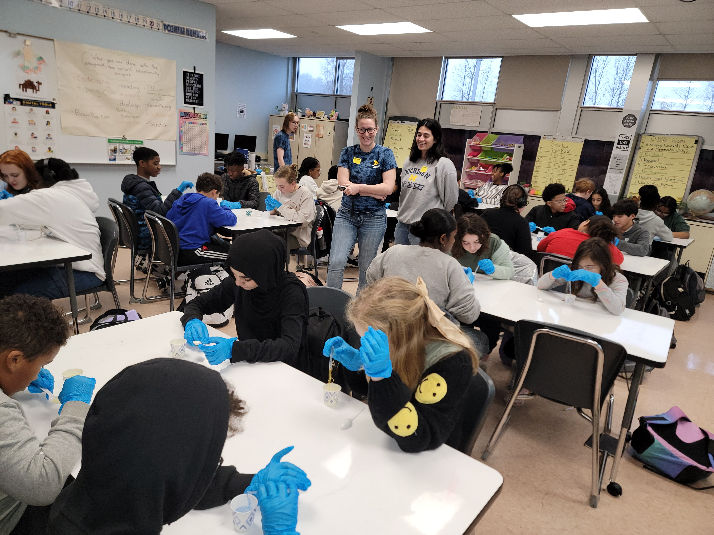
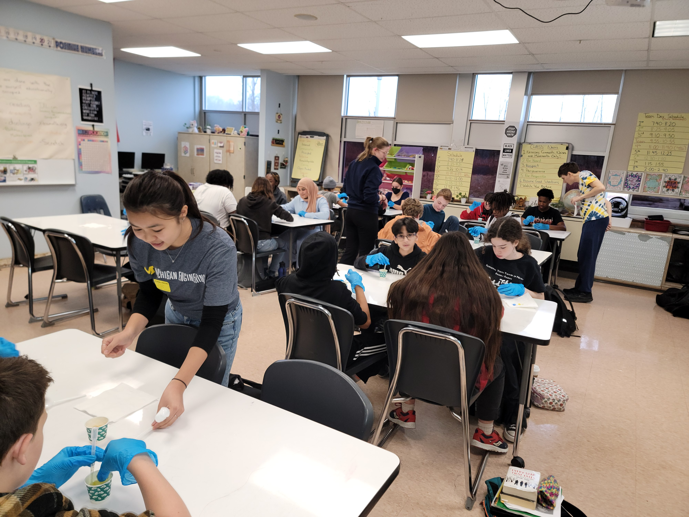

<!-- Homepage Header -->

  
  <h1 style="position: absolute; top: 50%; left: 50%; transform: translate(-50%, -50%);
             color: white; font-size: 3em; font-weight: bold; text-align: center;">
    University of Michigan MSE Outreach
  </h1>

## Explore Our Programs

  <!-- Card 1 -->
  <a href="/about_us/" style="width: 30%; text-decoration: none;">
    

      

        

          <strong>Who We Are</strong>
        

      

    

  </a>

  <!-- Card 2 -->
  <a href="/classroom_demos/battery_lab/" style="width: 30%; text-decoration: none;">
    

      

        

          <strong>Classroom Demos</strong>
        

      

    

  </a>

  <!-- Card 3 -->
  <a href="/at_home_demos/rock_candy/" style="width: 30%; text-decoration: none;">
    

      

        

          <strong>At-Home Demos</strong>
        

      

    

  </a>

---

## Event Highlights

  

    
  

  

    
  

  

    
  

  

    
  

---

## Get Involved

Whether you're a student, a teacher, or a curious learner — we welcome you!

[Contact Us](/about_us/)
