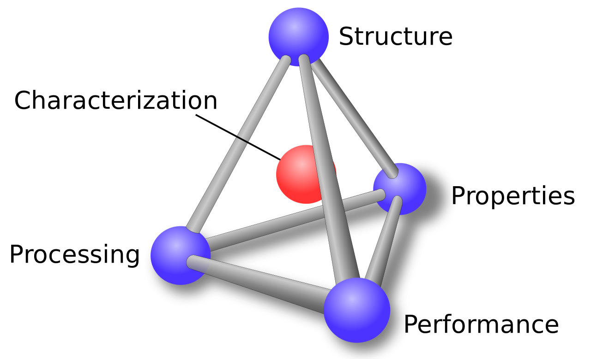
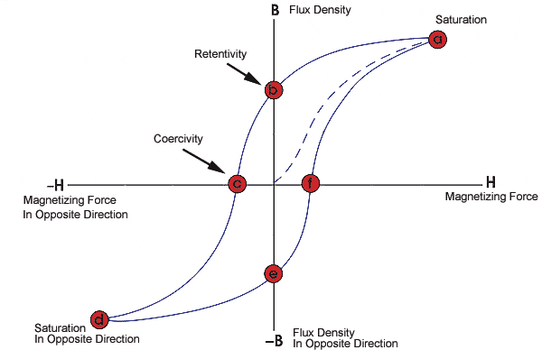
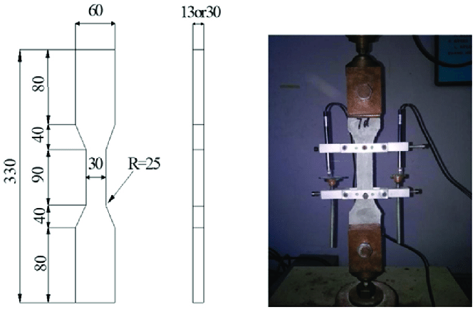

# What is MSE?

Materials Science & Engineering (MSE) is an interdisciplinary field that focuses on the study, design, and application of materials in various industries. It combines principles from physics, chemistry, engineering, and biology to understand how the structure of materials at the atomic, nano-, micro-, and macroscale affects their properties and performance. MSE has origins dating back to early mankind, often defining eras of our history such as the Stone Age, Bronze Age, Iron Age, and Steel Age. At the cornerstone of MSE is the *materials tetrahedron* that unites the fundamentals of materials science.

<figure markdown="span">
    { width="500", loading=lazy}
    <figcaption>The materials tetrahedron.</figcaption>
</figure>

## Structure
Atoms are the building blocks of all materials. However, materials scientists are concerned with structure all the way up to the macroscale. Differences in structure at each of these length scales in between ultimately influences end material.

  

    
    
  

  
<i>(Left) A crystal structure of BaCO3. (Right) A Bi-Sn microstructure.</i>

## Processing
Processing looks at how the different ways we make a material lead to different material structures and properties. Historically, physical metallurgy was likely the first example of humankind studying processing through the creation of different metal tools. Advancements in processing have allowed us to synthesize other classes of materials such as polymers, ceramics, biomaterials, semiconductors, and superconductors. Materials scientists use phase diagrams to synthesize materials.

<figure markdown="span">
    { width="500", loading=lazy}
    <figcaption>A temperature-pressure phase diagram of water. Adapted from: https://en.wikipedia.org/wiki/Phase_diagram</figcaption>
</figure>

## Properties

Materials exhibit a myriad of properties, which determine their usability and engineering applications. These properties can be broadly categorized as follows:

1. Mechanical Properties  
**Definition:** Mechanical properties describe how a material responds to forces and loads. These include strength, hardness, toughness, ductility, and elasticity.  
**Example:** Steel is strong and tough, making it ideal for construction and bridges.    

2. Chemical Properties  
**Definition:** Chemical properties define how a material reacts with other substances, including resistance to corrosion, oxidation, and chemical stability.  
**Example:** Stainless steel is highly resistant to rust due to its chromium content.   

3. Electrical Properties  
**Definition:** Electrical properties refer to a material’s ability to conduct or resist electrical currents. Important factors include conductivity, resistivity, and dielectric strength.  
**Example:** Copper has high electrical conductivity, making it ideal for wiring.   

4. Thermal Properties  
**Definition:** Thermal properties describe how a material responds to heat, including conductivity, expansion, and specific heat capacity.  
**Example:** Aluminum has high thermal conductivity, making it suitable for heat sinks.   

5. Optical Properties  
**Definition:** Optical properties involve how a material interacts with light, including transparency, reflectivity, and refractive index.  
**Example:** Glass is transparent, making it useful for windows and lenses.   

6. Magnetic Properties  
**Definition:** Magnetic properties describe a material's response to a magnetic field, including ferromagnetism, diamagnetism, and paramagnetism.  
**Example:** Iron is ferromagnetic, which makes it useful for electromagnets and transformers.  
 
The properties of a material determine its usability and engineering applications. Engineers select materials based on these properties to ensure efficiency, durability, and safety in different applications.

<figure markdown="span">
    { width="500", loading=lazy}
    <figcaption>A magnetic hysteresis loop demonstrating the magnetic properties of a material. Adapated from: https://www.nde-ed.org/Physics/Magnetism/HysteresisLoop.xhtml</figcaption>
</figure>

## Performance
The interplay between structure, processing, and properties determines a material's performance in different applications. If you think about all the components of an F1 car, each material used was carefully engineered to obtain a certain level of performance. For example, the chassis is made from lightweight carbon fiber and the wheels from a lightweight, high strength magnesium alloy.

<figure markdown="span">
    { width="500", loading=lazy}
</figure>

## Characterization
At the center of the materials tetrahedron is characterization which refers to the methods through which we evaluate each corner of the tetrahedron. The structure of materials are characterized most commonly by microscopes where we can image atoms, nanostructures, microstructures, and macrostructures. When we image these materials before and after processing, we can see how different processing parameters change the structure of our material. Additionally, we can characterize the properties and performance of a material through measurement like tensile tests that measure the strength of a material.

<figure markdown="span">
    { width="500", loading=lazy}
    <figcaption>A dog-bone sample for tensile testing from Zhao et. al., Materials 2019, 12, 3498. https://doi.org/10.3390/ma12213498</figcaption>
</figure>